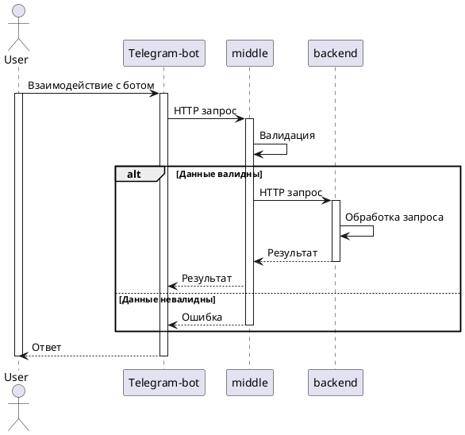

# Мини-банк проект

## Описание проекта
Проект представляет собой телеграм-бота, позволяющий управлять банковскими операциями клиента.

## Структура проекта
### Состоит из трёх компонентов:
- `frontend`: Компонент Telegram-bot. Выступает как клиентское приложение, инициирует запросы пользователей.
- `middle`: Java сервис. Принимает запросы от telegram-бота, выполняет валидацию и бизнес логику, маршрутизирует запросы в "Банк".
- `backend`: Java сервис. Принимает запросы от middle-сервиса. Выступает в качестве АБС (автоматизированная банковская система), обрабатывает транзакции, хранит клиентские данные и т. д.

## Схема взаимодействия компонентов
